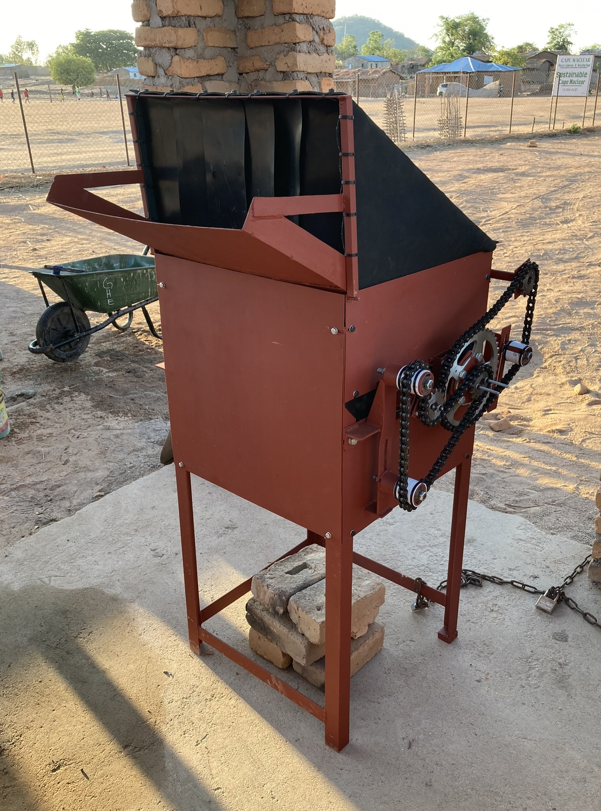

<!-- badges: start -->

<!-- badges: end -->

<h1> Low-Cost Glass Crusher for Cape Maclear, Malawi: Design, Maintenance, Operation, and Results </h1>

<b>Contributors</b>  
- Philippe Colbach <a href="https://orcid.org/0009-0004-5631-8744">
 0009-0004-5631-8744
</a> *author, maintainer*  
- Jakub Tkaczuk <a href="https://orcid.org/0000-0001-7997-9423">
 0000-0001-7997-9423
</a> *supervisor, developer*  
- Elizabeth Tilley <a href="https://orcid.org/0000-0002-2095-9724">
 0000-0002-2095-9724
</a> *supervisor*  

 

 

  
<b>Complete description of system design, functionalities, operation, and maintenance is available on: 
<a href="https://global-health-engineering.github.io/glass-crusher-design/">Github pages</a>.
</b>
  
It compliments the openly-accessible master’s thesis, available on the   
<a href="TO_BE_FILLED">ETH Research Collection</a>.

# Background

This repository details the construction, operation, and maintenance of the glass crusher built as part of a collaboration between the Malawian nonprofit organization, Sustainable Cape Maclear, and the Global Health Engineering Group at ETH Zürich.

Sustainable Cape Maclear has been working on the development and implementation of a solid waste management strategy to address the village’s struggle with waste build-up at informal dumpsites. The desired outcome is an improved quality of life for the community and the preservation of the village’s status quo as one of the country’s major tourist destinations. To support the effort, the glass crusher, described in this repository, was designed, constructed and tested as a part of the Master's thesis.

After evaluating already established glass crusher variants, the design of choice became a manually driven roller mill. During testing, the drivetrain proved to be a major weak point. Due to its insufficient structural strength, the crusher was unable to crush intact glass bottles. However, breaking the bottles first and inserting their shards into the crusher worked well, producing particles of various sizes ranging from powder to several centimeters. Therefore, a second and more basic crusher, not described in this repository but detailed in the thesis, was built to take over the initial bottle-breaking task. The latter can serve as a standalone crusher, if large shard sizes are sufficient, or it can be combined with the original crusher, if smaller sizes are desired. In hindsight, it would have been better to build a more basic and robust crusher right from the start to circumvent many of the issues that arose. Overall, the current system is nonetheless capable of processing the village’s daily amount of waste glass within an acceptable time frame.

{width=80%}

# pdf Documentation

All drawings necessary for the glass crusher construction are available in a pdf form in `pdf_doc/Glass_Crusher_Complete_Collection_of_Technical_Drawings.pdf`.

# License

The complete design and user manual are licensed under [Creative Commons Attribution 4.0 International](https://github.com/Global-Health-Engineering/glass-crusher-design/blob/main/LICENSE.md).
